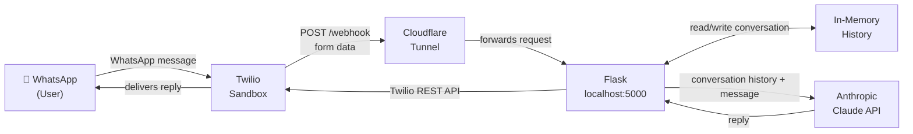
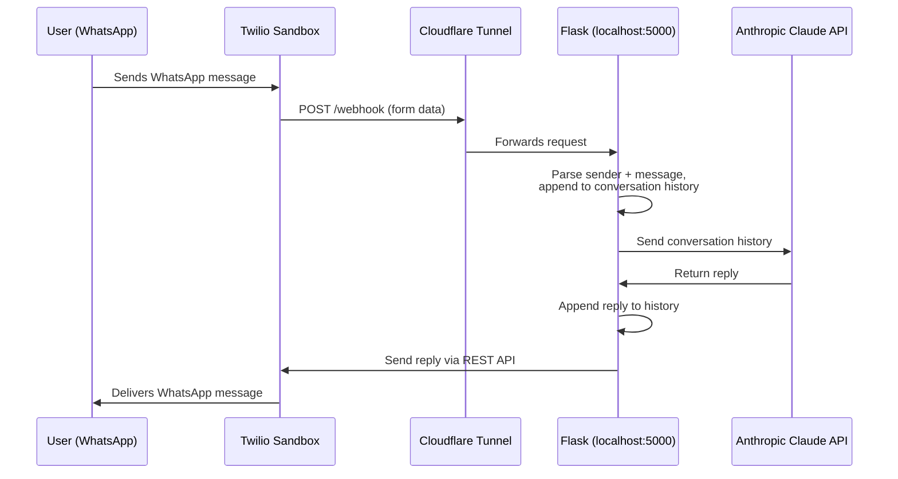

# WhatsApp Chatbot

A WhatsApp bot built with Python, Flask, Twilio, and Claude (claude-sonnet-4-6).

## How it works

Twilio receives WhatsApp messages and forwards them to your Flask webhook. The bot maintains per-conversation history in memory, sends it to Claude, and replies via Twilio.





---

## Setup

### 1. Clone and install dependencies

```bash
git clone https://github.com/ArielSmoliar/wa-chatbot.git
cd wa-chatbot
python3 -m venv venv
source venv/bin/activate   # Windows: venv\Scripts\activate
pip install -r requirements.txt
```

### 2. Configure environment variables

```bash
cp .env.example .env
```

Fill in `.env`:

| Variable | Where to find it |
|---|---|
| `TWILIO_ACCOUNT_SID` | [Twilio Console](https://console.twilio.com) → Account Info |
| `TWILIO_AUTH_TOKEN` | [Twilio Console](https://console.twilio.com) → Account Info |
| `TWILIO_WHATSAPP_NUMBER` | `whatsapp:+14155238886` (sandbox default) |
| `ANTHROPIC_API_KEY` | [console.anthropic.com](https://console.anthropic.com) |
| `VALIDATE_TWILIO_SIGNATURE` | Set to `false` for local development, `true` for production |

### 3. Join the Twilio WhatsApp Sandbox

From your WhatsApp, send the following message to **+1 415 523 8886**:

```
join whistle-frame
```

You will receive a confirmation that you have joined the sandbox.

### 4. Run the Flask app

```bash
python3 app.py
```

The server starts on `http://127.0.0.1:5000`.

### 5. Expose it with Cloudflare Tunnel

In a separate terminal:

```bash
brew install cloudflare/cloudflare/cloudflared
cloudflared tunnel --url http://127.0.0.1:5000
```

Copy the tunnel URL from the output, e.g. `https://your-tunnel-name.trycloudflare.com`.

> **Note:** Cloudflare Tunnel is recommended over ngrok for this setup. ngrok's free and hobbyist plans intercept webhook requests before they reach Flask, causing 403 errors.

> **Note:** Cloudflare generates a new URL each time you run the tunnel. You will need to update the Twilio sandbox webhook URL each session.

### 6. Configure the Twilio Sandbox webhook

1. Go to [Twilio Console → Messaging → Try it out → Send a WhatsApp message](https://console.twilio.com/us1/develop/sms/try-it-out/whatsapp-learn)
2. Under **Sandbox settings**, paste your tunnel URL into the **"When a message comes in"** field:
   ```
   https://your-tunnel-name.trycloudflare.com/webhook
   ```
3. Set the method to **HTTP POST** and save.

---

## Usage

| Send | Bot does |
|---|---|
| Any message | Replies using Claude with full conversation context |
| `reset` | Clears your conversation history and starts fresh |

---

## Notes

- Conversation history is stored **in memory** and resets when the server restarts.
- The Twilio sandbox requires each user to join before they can exchange messages.
- For production use, replace in-memory history with a persistent store (Redis, Postgres, etc.), deploy to a public server, and set `VALIDATE_TWILIO_SIGNATURE=true`.

---

## Main Learnings

Two non-obvious issues worth knowing before you start:

- ngrok free and hobbyist plans block webhook traffic. The interstitial page ngrok adds for non-browser requests intercepts Twilio webhooks before they reach your app, returning 403 with no clear error. Use Cloudflare Tunnel instead (`cloudflared tunnel --url http://127.0.0.1:5000`). It is free, requires no account, and passes all traffic through cleanly.

- Pop the user message from history if the Claude API call fails. If you append the user message before calling Claude and the call fails, you must remove it before returning the fallback reply. Otherwise the next successful call sends a dangling user message with no preceding assistant response, which breaks the alternating user/assistant structure the API requires and causes cryptic errors.

---

## License

MIT License. See [LICENSE](LICENSE) for details.
